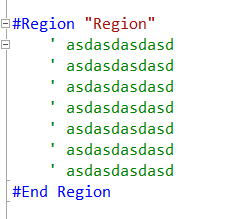

Region Tabber for CodeRush 
===============

This plugin provides an extension to the Tab-To-Next-Reference feature of   [CodeRush](http://devexpress.com/coderush).

Using this plugin you can now Tab between matching #Region and #End region directives.

Usage
=====

Place your caret on a **#Region** or **#End Region** directive and hit the **Tab** or *Shift+Tab* key combination.

**Note: Currently this plugin is disabled when Region Paining is enabled.**

